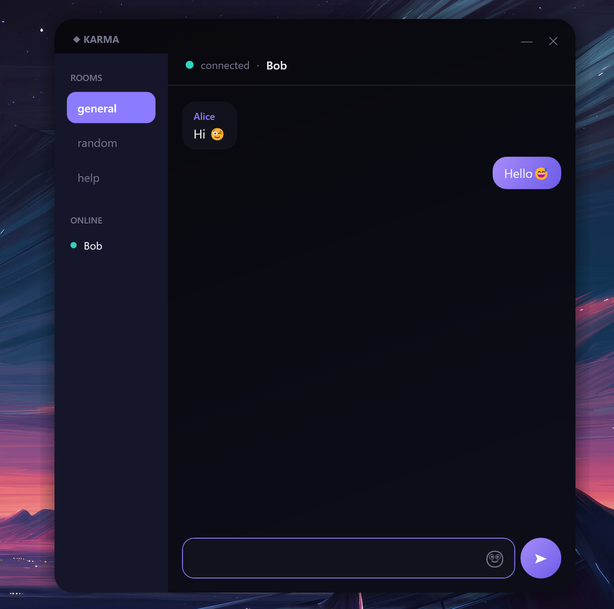

# Karma

A real-time chat app: a WPF desktop client talking to an ASP.NET Core server over SignalR,
with MySQL for message history. Kept intentionally simple.

## What it does

- Real-time messaging — messages show up instantly on every connected client, no polling.
- Three chat rooms (`general`, `random`, `help`) you can switch between from a sidebar.
- A live list of who's currently online.
- Message history is stored in MySQL, so the last 50 messages per room reload when you (re)join.
- Automatic reconnect if the server restarts or the connection drops — the client picks its
  room back up once it's back online.
- An emoji picker (the 🙂 button in the message box) — emoji render in full color, live as you
  type, not just after sending.

There's no accounts or authentication — you just type a username and you're in. It's meant for
people on the same machine or local network to talk to each other, not a production chat service.

## Running it

You need Docker (for MySQL) and the .NET 10 SDK.

```powershell
docker compose up -d                      # starts MySQL
dotnet run --project ChatApp.Server       # starts the server, applies DB migrations automatically
dotnet run --project ChatApp.Client       # opens one chat window, please run it multiple times in mutliple terminal windows
```

## Stack

- **WPF** for the client — it's what the assignment asked for.
- **ASP.NET Core + SignalR** for the server and the real-time transport.
- **EF Core + MySQL** (via Pomelo) for persisting messages.

## A few decisions worth explaining

**SignalR instead of raw WebSockets.** The assignment allowed either a raw WebSocket/REST setup
or something equivalent. SignalR sits on top of WebSockets (falling back to other transports if
needed) and gives you connection management, automatic reconnect, and a simple RPC-style API for
free — calling a method on the client shows up as a method call on the server and vice versa.
For a chat app that's exactly the plumbing you'd otherwise have to write by hand, so there wasn't
much reason not to use it.

**Rooms are SignalR "groups", not a separate concept.** A room is really just a named group that
a connection joins or leaves; broadcasting "to a room" is broadcasting to that group. This kept
the room feature cheap to add without introducing new infrastructure — no per-room server state
to manage beyond what SignalR already tracks.

**Presence is a small in-memory tracker, not stored in the database.** Who's online only matters
while the app is running, so it lives in a singleton dictionary on the server (connection ID →
username) rather than a DB table. It resets naturally if the server restarts, which is fine —
there's nothing to "recover".

**Rooms and usernames are not validated against a fixed list of users.** Anyone can type any
username and join any of the three rooms. This is deliberate — the assignment didn't call for
accounts, and adding auth would have been a lot of extra surface for no real benefit here.

## Project layout

```
ChatApp.Server/   ASP.NET Core app: the SignalR hub, EF Core models, MySQL migrations
ChatApp.Client/   WPF app: login screen, chat window, room sidebar
docker-compose.yml  MySQL container definition
```

## How the app looks like 


